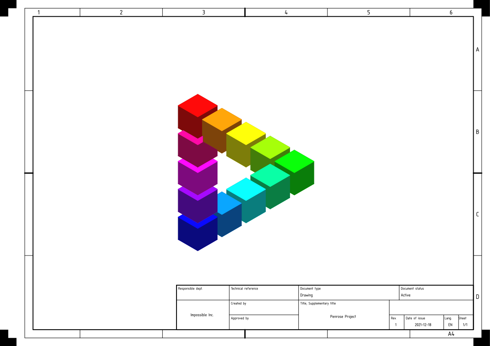

## KICAD2TechDraw

The KiCAD project includes a set of well-made templates for use in its 
schematic editor. This repository is a set of python scripts to convert those 
templates to a format usable in [FreeCAD's](https://github.com/FreeCAD/FreeCAD)
[TechDraw](https://wiki.freecad.org/TechDraw_Workbench) workbench.

## Usage

To run the script:

```
python kicad_wks2svg.py
```

Alternatively, the 
[./out directory](https://github.com/alexneufeld/KiCAD2TechDraw/tree/main/out) 
has a set of already translated svg files.

## Notes

- `kicad_wks2svg.py` is only programmed well enough to get the job done. Don't 
  expect it to not break if given arbitrary input.
- [This Thread](https://github.com/KiCad/kicad-templates/pull/25)
  is an in-depth look at how KiCAD's ISO5457 templates were originally
  developed. It's worth a read.

## Other Links

- [KiCAD Templates](https://gitlab.com/kicad/libraries/kicad-templates) repository
- The `.kicad_wks` file parser was copied from 
  [This repository](https://github.com/DerekHarter/python-lisp-parser)

## Example of results:


